<h1 align="center">🍙 windots</h1>

<div align="center">
  <a href="#about"><kbd> <br> 🌷 About <br> </kbd></a>&ensp;&ensp;
  <a href="#setup"><kbd> <br> 🔧 Setup <br> </kbd></a>&ensp;&ensp;
  <a href="#gallery"><kbd> <br> 🖼️ Gallery <br> </kbd></a>&ensp;&ensp;
  <a href="#credits"><kbd> <br> 🎉 Credits <br> </kbd></a>&ensp;&ensp;
</div>

<br>

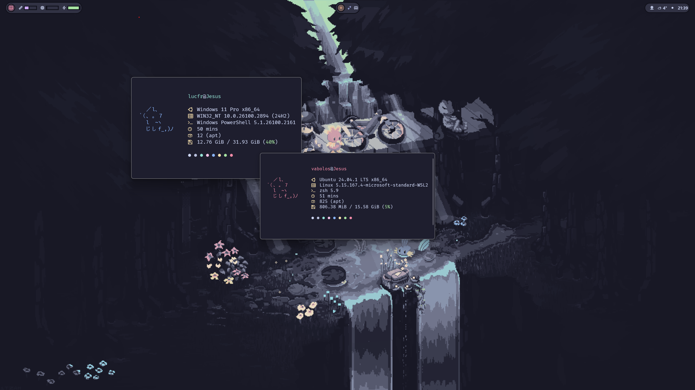<br/><br/>
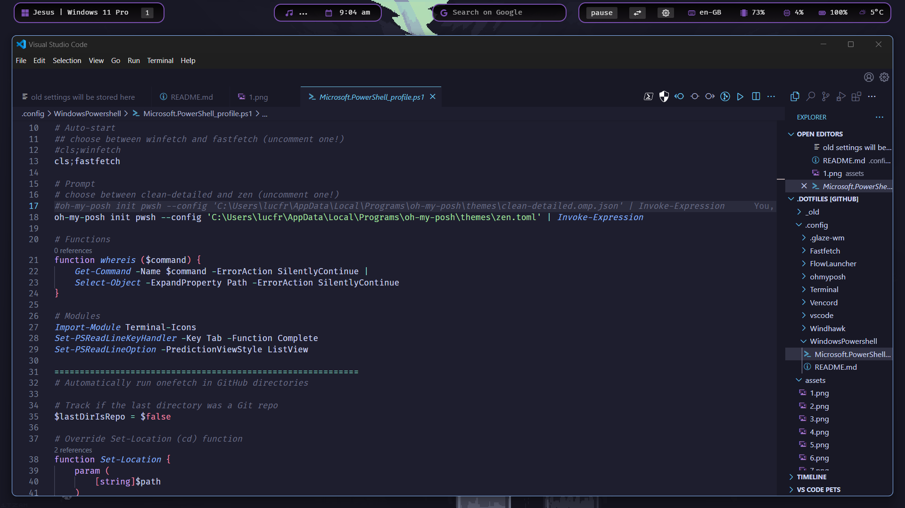<br/><br/>
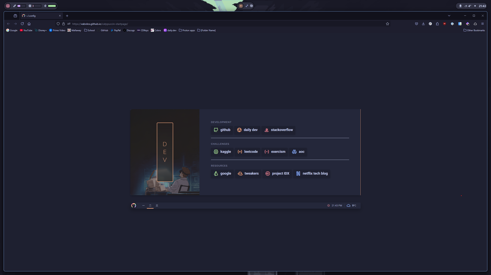<br/><br/>
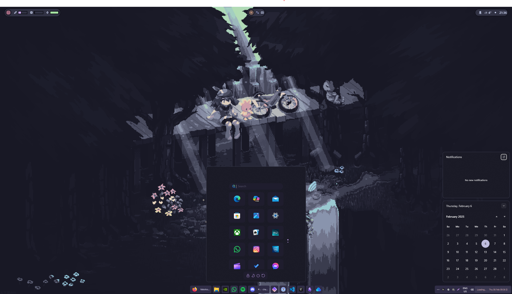<br/><br/>
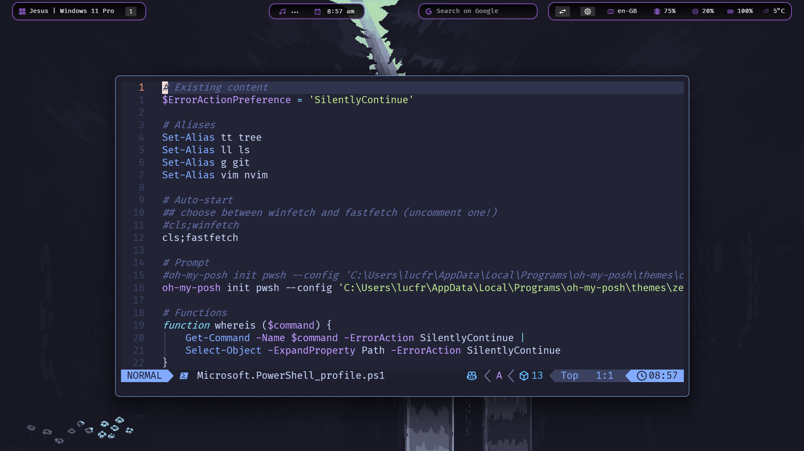<br/><br/>

<div align="center">
<p>
<a href="https://github.com/vabolos/windots/stargazers"><a>&nbsp;&nbsp;
<a href="https://github.com/vabolos/windots/"></a>&nbsp;&nbsp;
<a href="https://github.com/vabolos/windots/commits/main/"></a>&nbsp;&nbsp;
<a href="https://github.com/vabolos/windots/LICENSE"></a>&nbsp;&nbsp;
</p>
</div>

<h2 id="about">🌷 About</h2>

#### 💖 For the Ricing and [r/unixporn](https://reddit.com/r/unixporn) Enthusiasts

Welcome Ricers! 👋 If you're a Windows user feeling stuck in your ricing journey and want a setup similar to Unix environments, this collection of dotfiles is for you. Tailored for a Windows setup, these configs will help you elevate your system's aesthetics and functionality to the next level!

> [!NOTE]
> All configs related to my **Linux setup (WSL2)** are maintained in this repository: [**dotfiles**](https://github.com/vabolos/dotfiles)

## ✨ Features

- 🪟 Glazewm config
- ❄️ Beautiful YASB config
- 🌸 Minimal VSCode setup
- \>\_ Sleek windows terminal config
- 🐚 Powershell config
- 🎨 Ohmyposh theme
- ⚙️ Minimal fastfetch config
- 🚀 Flow launcher config
- 🦅 Themeable Start menu, Taskbar and Notification center
- 💫 Beautiful [Wallpapers](https://github.com/Vabolos/windots/tree/main/wallpapers#readme)
- 🐈 [Catppuccin](https://github.com/catppuccin) everywhere

<hr/>

## 🌸 Core System Info

- **OS:** [Windows 11](https://www.microsoft.com/en-in/windows/windows-11) 🪟 + [WSL2](https://learn.microsoft.com/en-us/windows/wsl/) 🐧
- **WM:** [GlazeWM](https://github.com/glzr-io/glazewm) ✨
- **Shell:** [powershell](https://learn.microsoft.com/en-us/powershell/) / [zsh](https://zsh.sourceforge.io/) 🐚
- **Terminal Emulator:** [Windows terminal](https://github.com/microsoft/terminal) >\_
- **Panel:** [YASB](https://github.com/amnweb/yasb) ❄️
- **Text Editor:** [VSCode](https://code.visualstudio.com/) and [neovim](https://neovim.io/) ⌨️
- **App Launcher:** [Flow launcher](https://www.flowlauncher.com/) 🚀
- **File Manager:** [File explorer](https://www.microsoft.com/en-us/windows/tips/file-explorer) / [yazi](https://yazi-rs.github.io/) 📂
- **Browser:** [Zen-Browser](https://zen-browser.app) 🌐
- **Colorscheme:** [Catppuccin](https://catppuccin.com/) 🎨

<hr/>

### ℹ️ Whole System Info

Here is all the information about my setup:

> [!NOTE]
> Some of this apps have the **config files** included in the repo, which are marked with ⚙️. Also, my **favorite programs and tools** are marked with 💖.

#### 🪟 System

| 📚 Entry                 | ✨ App                                                                                                                                        |
| ------------------------ | --------------------------------------------------------------------------------------------------------------------------------------------- |
| **OS**                   | [Windows 11](https://www.microsoft.com/en-in/windows/windows-11) + [WSL2](https://learn.microsoft.com/en-us/windows/wsl/)                     |
| **Window Manager**       | 💖 [GlazeWM](https://github.com/glzr-io/glazewm) [⚙️](https://github.com/Vabolos/windots/blob/main/.config/.glaze-wm/config.yaml)             |
| **Bar**                  | 💖 [YASB](https://github.com/amnweb/yasb) [⚙️](https://github.com/vabolos/windots/tree/main/.config/yasb)                                     |
| **Application Launcher** | [Flow Launcher](https://www.flowlauncher.com/) [⚙️](https://github.com/Vabolos/windots/blob/main/.config/FlowLauncher/Settings/Settings.json) |
| **Mods**                 | 💖 [Windhawk](https://windhawk.net/) [⚙️](https://github.com/Vabolos/windots/tree/main/.config/Windhawk)                                      |

#### 🖥️ CLI/TUI Apps

| 📚 Entry                 | ✨ App                                                                                                                                                                                                                                                                                                                                      |
| ------------------------ | ------------------------------------------------------------------------------------------------------------------------------------------------------------------------------------------------------------------------------------------------------------------------------------------------------------------------------------------- |
| **Shell**                | 💖 [zsh](https://zsh.sourceforge.io/) [⚙️](https://github.com/vabolos/dotfiles/blob/main/.zshrc) / [pwsh](https://learn.microsoft.com/en-us/powershell/module/microsoft.powershell.core/about/about_pwsh?view=powershell-7.4) [⚙️](https://github.com/vabolos/windots/blob/main/.config/WindowsPowershell/Microsoft.PowerShell_profile.ps1) |
| **Terminal Emulator**    | [windows terminal](https://github.com/microsoft/terminal) [⚙️](https://github.com/Vabolos/windots/blob/main/.config/Terminal/settings.json)                                                                                                                                                                                                 |
| **Terminal Multiplexer** | 💖 [tmux](https://github.com/tmux/tmux) [⚙️](https://github.com/vabolos/dotfiles/blob/main/.config/tmux/tmux.conf)                                                                                                                                                                                                                          |
| **Shell Prompt**         | [ohmyposh](https://ohmyposh.dev/) [⚙️](https://github.com/vabolos/windots/blob/main/.config/ohmyposh/zen.toml)                                                                                                                                                                                                                              |
| **Text Editor**          | 💖 [neovim](https://neovim.io/) [⚙️](https://github.com/vabolos/dotfiles/tree/main/.config/nvim) / 💖 [Zed](https://zed.dev/) [⚙️](https://github.com/Vabolos/windots/tree/main/.config/Zed)                                                                                                                                                |
| **CD Replacement**       | 💖 [zoxide](https://github.com/ajeetdsouza/zoxide)                                                                                                                                                                                                                                                                                          |
| **LS Replacement**       | [eza](https://github.com/eza-community/eza)                                                                                                                                                                                                                                                                                                 |
| **Cat Replacement**      | [bat](https://github.com/sharkdp/bat) [⚙️](https://github.com/vabolos/dotfiles/tree/main/.config/bat)                                                                                                                                                                                                                                       |
| **File Manager**         | 💖 [yazi](https://yazi-rs.github.io/) [⚙️](https://github.com/vabolos/dotfiles/tree/main/.config/yazi)                                                                                                                                                                                                                                      |
| **Fuzzy File Finder**    | 💖 [fzf](https://github.com/junegunn/fzf)                                                                                                                                                                                                                                                                                                   |
| **Git TUI**              | [lazygit](https://github.com/jesseduffield/lazygit)                                                                                                                                                                                                                                                                                         |
| **System Monitor**       | [btop](https://github.com/aristocratos/btop) [⚙️](https://github.com/vabolos/dotfiles/blob/main/.config/btop/btop.conf)                                                                                                                                                                                                                     |
| **System Fetch**         | [fastfetch](https://github.com/fastfetch-cli/fastfetch) [⚙️](https://github.com/vabolos/dotfiles/blob/main/.config/fastfetch/config.jsonc)                                                                                                                                                                                                  |
| **Git Fetch**            | [onefetch](https://github.com/o2sh/onefetch)                                                                                                                                                                                                                                                                                                |
| **Audio Visualizer**     | [cava](https://github.com/karlstav/cava)                                                                                                                                                                                                                                                                                                    |

#### 🖥️ CLI/TUI Apps (Configs for these can be found in this repo: [**dotfiles**](https://github.com/ashish0kumar/dotfiles))

| 📚 Entry                 | ✨ App                                                                                                                        |
| ------------------------ | ----------------------------------------------------------------------------------------------------------------------------- |
| **Fallback Text Editor** | [VSCode](https://code.visualstudio.com/) [⚙️](https://github.com/ashish0kumar/windots/blob/main/.config/vscode/settings.json) |
| **Music Player**         | 💖 [Spotify](https://open.spotify.com/) (patched with [Spicetify](https://spicetify.app/))                                    |
| **Web Browser**          | 💖 [Zen-Browser](https://zen-browser.app) 🏡 [startpage](https://github.com/ashish0kumar/startpage)                           |
| **Note Taking App**      | 💖 [Obsidian](https://obsidian.md/)                                                                                           |
| **File Manager**         | [File Explorer](https://www.microsoft.com/en-us/windows/tips/file-explorer)                                                   |
| **Office Apps**          | [LibreOffice](https://www.libreoffice.org/)                                                                                   |

#### 🔍 Other

| 📚 Entry             | ✨ App                                                   |
| -------------------- | -------------------------------------------------------- |
| **Colorscheme**      | 💖 [Catppuccin Mocha](https://catppuccin.com/)           |
| **Font**             | [FiraCode Nerd Font](https://www.jetbrains.com/lp/mono/) |
| **Dotfiles Manager** | 💖 [GNU Stow](https://www.gnu.org/software/stow/)        |

<h2 id="setup">🔧 Setup</h2>

> [!WARNING]
> Before proceeding, make sure to **backup your existing configuration files**.  
> Some settings may overwrite your current setup, so **manually merge or restore** if needed.

### 🪟 GlazeWM

> [!NOTE]  
> This setup is compatible with the latest version of **GlazeWM** but **does not use Zebar**. Instead, it uses **YASB** for the bar.

- **Install** [**GlazeWM**](https://github.com/glzr-io/glazewm/releases/).

- `windots/.config/glazewm/config.yaml` → `%USERPROFILE%\.glzr\glazewm\config.yaml`

- **Restart GlazeWM** for the changes to take effect.

### 📊 YASB (Yet Another Status Bar)

- **Install** [**YASB**](https://github.com/amnweb/yasb/releases/).

- `windots/.config/yasb/` → `%USERPROFILE%\.config\yasb\`

- **Restart YASB** for the changes to take effect.

### 📝 VSCode

- Enhance your **VSCode UI** with these **extensions**: - [APC Customize UI](https://marketplace.visualstudio.com/items?itemName=drcika.apc-extension) - Customize the VSCode interface

  - [GlassIt-VSC](https://marketplace.visualstudio.com/items?itemName=s-nlf-fh.glassit) - Add a transparent/glass effect (optional)

- `windots/.config/vscode/settings.json` → `%APPDATA%\Code\User\settings.json`

- **Restart VSCode** to load the updated settings.

### 🚀 Flow Launcher

- **Install** [**Flow Launcher**](https://www.flowlauncher.com/)

- `windots/.config/FlowLauncher/Settings.json` → `%APPDATA%\FlowLauncher\Settings\Settings.json`

- Restart Flow Launcher

### 🦅 Windhawk

- **Install** [**Windhawk**](https://windhawk.net/).
- **Install Relevant Mods** from the [Windhawk Store](https://windhawk.net/explore):
  - Notification Center Styler
  - Start Menu Styler
  - Taskbar Styler
- **Copy** the Windhawk config files from `windots/.config/windhawk/`
- **Apply the tweaks** from the Windhawk UI.

## \>\_ Terminal & Shell Setup

### 🖥️ Windows Terminal

- Install [Windows Terminal](https://github.com/microsoft/terminal)

- `windots/.config/terminal/settings.json` → `%LOCALAPPDATA%\Packages\Microsoft.WindowsTerminal_8wekyb3d8bbwe\LocalState\settings.json`

- Restart Windows Terminal to see the updated configurations.

### 🐚 PowerShell

- `windots/.config/WindowsPowershell/Microsoft.PowerShell_profile.ps1` → `%USERPROFILE%\Documents\WindowsPowerShell\Microsoft.PowerShell_profile.ps1`

- Restart PowerShell to apply the changes.

### 🎨 Oh My Posh

- **Install** [**Oh My Posh**](https://ohmyposh.dev/docs/installation/windows) using winget:

```bash
winget install JanDeDobbeleer.OhMyPosh -s winget
```

- `windots/.config/ohmyposh/zen.toml` → `%USERPROFILE%\.config\ohmyposh\zen.toml`

- **Optional Step:** Skip this if you applied my PowerShell config.
  - I have already included the command to set the theme in the PowerShell profile, so there's no need to do it manually. The following command is automatically applied when PowerShell starts:

```bash
oh-my-posh init pwsh --config "$env:USERPROFILE\.config\ohmyposh\zen.toml" | Invoke-Expression
```

### ⚙️ Fastfetch

- **Install** [**fastfetch**](https://github.com/fastfetch-cli/fastfetch) using **winget**:

```bash
winget install fastfetch
```

- `windots/.config/fastfetch/config.conf` → `%USERPROFILE%\.config\fastfetch\config.conf`

- **Run fastfetch**.

### 🌿 Onefetch

> [!WARNING]
> This command only works in Git repositories which are downloaded/stored on a local device, once in it you can manually run the command. <br/> The command is automatically executed in the [pwsh profile config](https://github.com/Vabolos/windots/blob/main/.config/Terminal/settings.json) when entering a local Git repository.

- Install [onefetch](https://github.com/o2sh/onefetch) using winget:

```bash
winget install onefetch
```

- Run onefetch

<hr/>

## ⌨️ GlazeWM keybindings

You can always change these in your `glazewm/config.yaml`

| Keys                                                            | Action                                              |
| --------------------------------------------------------------- | --------------------------------------------------- |
| <kbd>alt</kbd> + <kbd>enter</kbd>                               | Open terminal                                       |
| <kbd>alt</kbd> + <kbd>h \| j \| k \| l</kbd>                    | Focus window left \| top \| bottom \| right         |
| <kbd>alt</kbd> + <kbd>shift</kbd> + <kbd>h \| j \| k \| l</kbd> | Move focusing window left \| top \| bottom \| right |
| <kbd>alt</kbd> + <kbd>q</kbd>                                   | Close focusing window                               |
| <kbd>alt</kbd> + <kbd>1 - 9</kbd>                               | Focus workspace {n}                                 |
| <kbd>alt</kbd> + <kbd>shift</kbd> + <kbd>1 - 9</kbd>            | Move focusing window to workspace {n}               |
| <kbd>alt</kbd> + <kbd>m</kbd>                                   | Toggle window minimization                          |
| <kbd>alt</kbd> + <kbd>f</kbd>                                   | Toggle window maximization                          |
| <kbd>alt</kbd> + <kbd>v</kbd>                                   | Change tiling direction                             |
| <kbd>alt</kbd> + <kbd>t</kbd>                                   | Make focusing window float/tiled                    |
| <kbd>alt</kbd> + <kbd>shift</kbd> + <kbd>e</kbd>                | Exit glazewm                                        |

<hr/>

<h2 id="gallery">🖼️ ‎Gallery</h2>

> [!NOTE]
> You can check out the **wallpapers** [**here**](https://github.com/Vabolos/windots?tab=readme-ov-file#gallery) if you’d like to check them out.

| **Browser on [r/unixporn](https://reddit.com/r/unixporn) and cmatrix, cbonsai scripts** |
| --------------------------------------------------------------------------------------- |
| 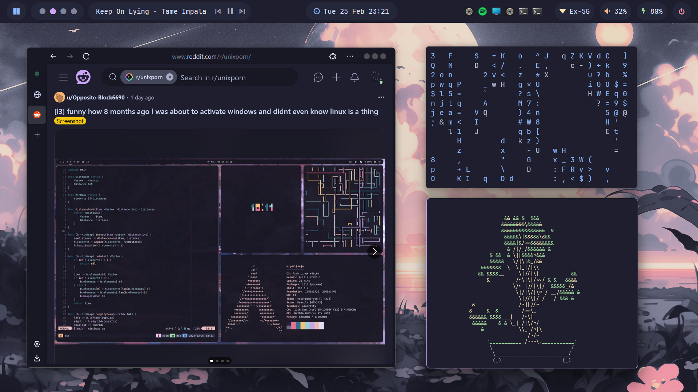                                                                |

| **GUI Text Editor**    |
| ---------------------- |
|  |

| **Topbar menu and TUI System Monitor** |
| -------------------------------------- |
| 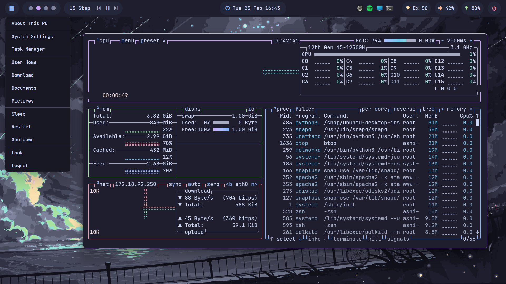                   |

| **Browser [startpage](https://github.com/vabolos/startpage)** |
| ------------------------------------------------------------- |
|                                      |

| **Text Editor**      |
| -------------------- |
|  |

| **Fuzzy finder preview, ls replacement and cd preview** |
| ------------------------------------------------------- |
|                              |

| **TUI File Manager** |
| -------------------- |
| 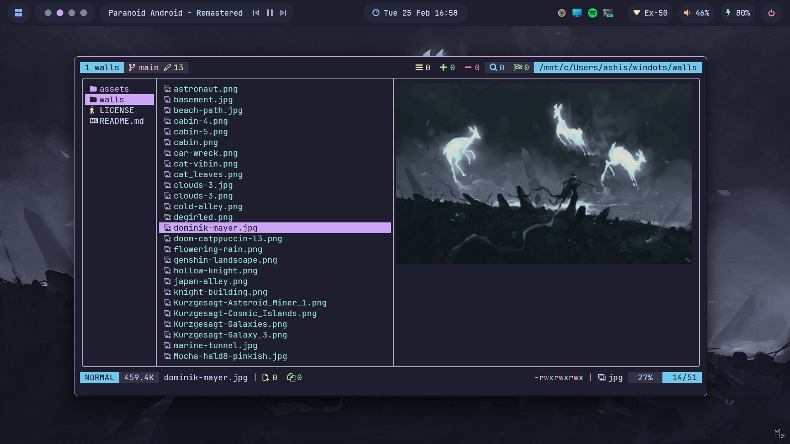 |

| **Start Menu, Taskbar and Notification Center** |
| ----------------------------------------------- |
|                         |

| **Topbar Calendar Widget, tty-clock and App Launcher** |
| ------------------------------------------------------ |
| 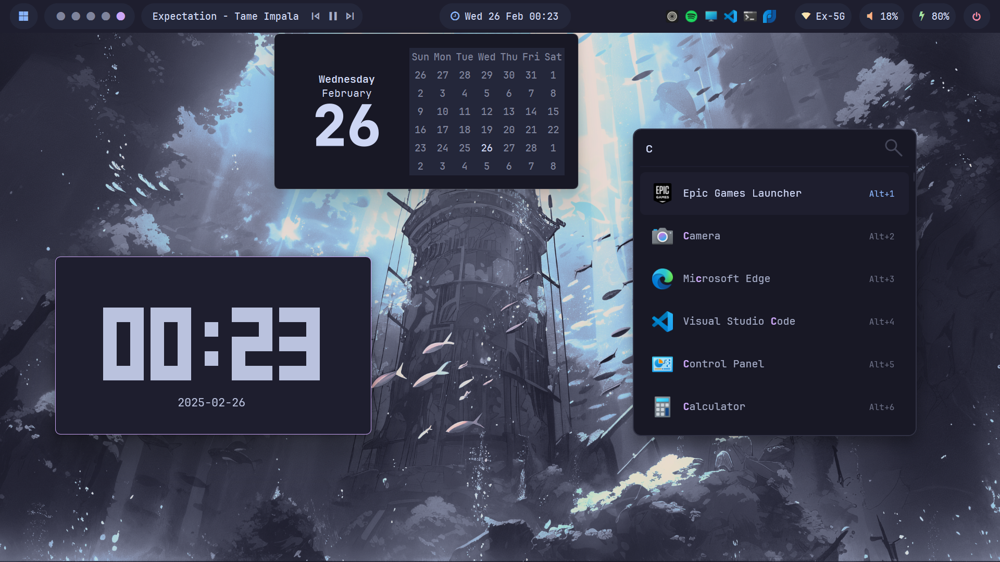                              |

| **Git UI Manager and Telescope find_files** |
| ------------------------------------------- |
| 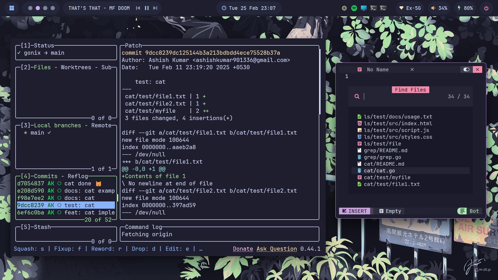               |

| **Music Player and CLI Music Visualiser** |
| ----------------------------------------- |
| 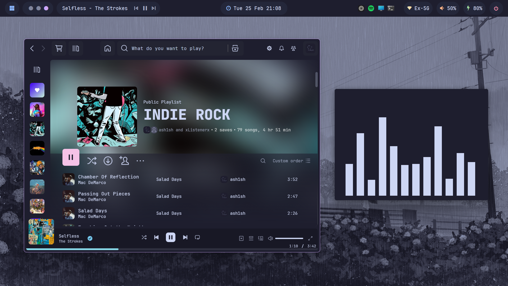                   |

| **Power Menu**        |
| --------------------- |
| 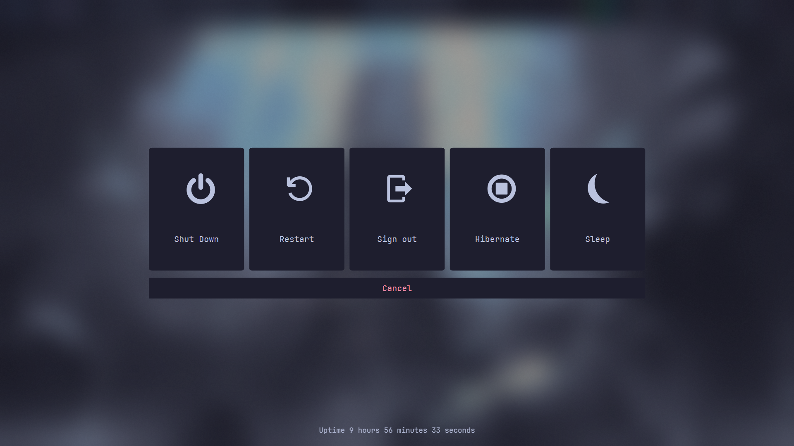 |

<hr>

## 📜 License

Feel free to use and modify these dotfiles to suit your needs.

<h2 id="credits">🎉 ‎Credits</h2>

Big thanks to everyone at [r/unixporn](https://reddit.com/r/unixporn) for inspiring me to make this!

I wanna point out some resources that helped me the most with the setup:

- [Ashish0kumar's README](https://github.com/ashish0kumar/dotfiles/blob/master/README.md) to help me with the overall design and distribution of the README 🙏
- [GlazeWM](https://github.com/glzr-io/glazewm) for providing an incredible tiling window manager experience that enhances my workflow and productivity ✨
- [LierB](https://github.com/LierB/fastfetch) for the fastfetch config presets 📋
- [Dreams of Autonomy](https://youtu.be/9U8LCjuQzdc?feature=shared) for the zenful ohmyposh theme 🧘
- [lunar-os](https://github.com/lunar-os/windowsdesktop2) for the Windhawk configs 🦅
- [pivoshenko](https://github.com/pivoshenko/catppuccin-startpage) for the aesthetic and clean browser startpage 🌐
- [orxngc](https://github.com/orxngc/walls-catppuccin-mocha) for all the beautiful catppuccinified wallpapers 🖼️
- [Catppuccin](https://catppuccin.com) for making the Best Colorscheme Ever 🖌️
- [ashish0kumar](https://github.com/ashish0kumar/) for the repo inspiration 🌟

## ✍️ Contributing

Part of what makes the open source community special are the contributions. Any contributions will be **highly appreciated!**

If you have any ideas or suggestions to make, feel free to [open an issue](https://github.com/vabolos/windots/issues) or [submit a PR](https://github.com/vabolos/windots/pulls)

## 💫 Star History

<a href="https://star-history.com/#vabolos/windots&Date">
 <picture>
   <source media="(prefers-color-scheme: dark)" srcset="https://api.star-history.com/svg?repos=vabolos/windots&type=Date&theme=dark" />
   <source media="(prefers-color-scheme: light)" srcset="https://api.star-history.com/svg?repos=vabolos/windots&type=Date" />
   
 </picture>
</a>

<br><br>

<p align="center">
	
</p>
